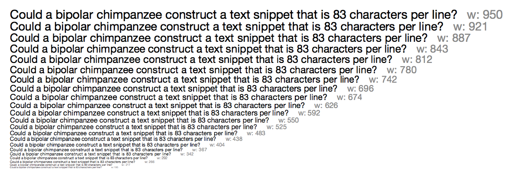

# Get Next Line 
<br/>

The aim of this project is to code a function that returns a line ending with a newline, read from a file descriptor.

Pls see <a href="./subject.pdf">subject.pdf</a> for the assignment<br/>

All files related to the function are located in **get_next_line** folder.
You can test the code with attached *main.c* and *text.txt* files. Also you can change the first argument in *get_next_line* in *main.c* on 25th line to '0' to read from *stdin*.  <br/>

*Build and run:*
```
> gcc main.c get_next_line/*.c -o gnl
> ./gnl
```

To specify your own buffer add the flag `-D BUFFER_SIZE=xx` to the compile line, where `xx` is your value.
