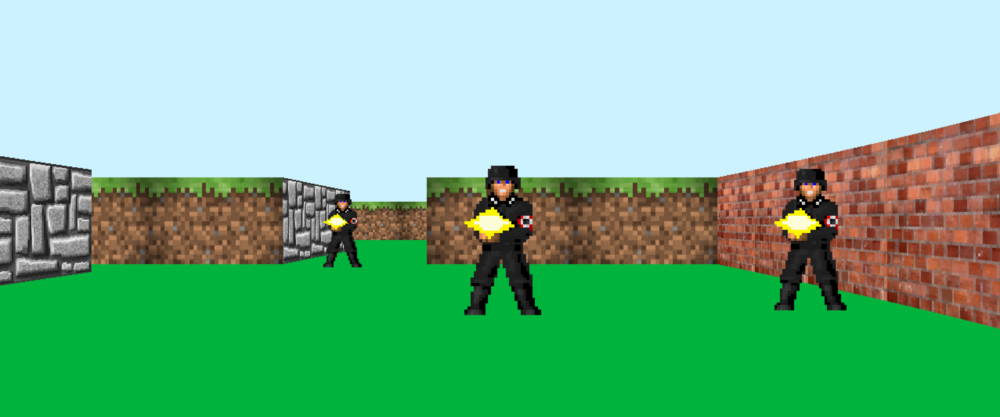
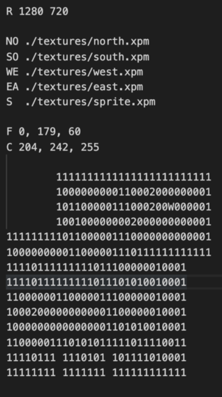

<p style="text-align: center; font-size: 60px; margin-bottom: 0; font-weight: 600;">cub3D</p>
<p style="text-align: center; font-size: 30px; line-height: 0.1">a game engine like Wolfenstein 3D</p>

------------

❗The structure of the code may look strange, this is caused by the coding rules of School 21 (no more than 25 lines for one function etc.).

------------

The project was made using raycasting technology and with MinilibX (Simple graphics library)

------------
Please see the **en.subject.pdf** file for getting the assignments.

------------
#### Build and Run:

- Download the project folder, move there in your terminal and run commands in terminal:

```
make
./cub3D map.cub

```
#### Controls
```
W A S D  or ↑↓                   move
← →                              turn right / turn left
```
#### Configuration file `map.cub`
```
Config file called `map.cub` and it must lie at the root of the project.

R                                resolution
C                                ceiling rgb color
F                                floor rgb color
NO SO WE EA                      paths to textures
S                                path to sprite
                                 empty lines

Valid map is surrounded by walls (1) and can contain these characters

1                                wall
0                                player can move here
2                                sprite/item
N S E W                          player position and view direction
space                            empty space (player can't see them)

map can't be splitted by empty lines
```
To use your own textures or sprites you have to convert them to .xpm with size of 64px x 64px and add to the config file pathes to them.

The config file has protection for incorrect data.

Example of a valid config file:<br/>


### Make a Screenshot
To make a screenshot of current player's view you need to add flag --save after config file. The screenshot will appear at the root of the project with the name **screenshot.bmp**
```
 ./cub3D map.cub --save

```
 <br/>
------------
<sub>The project is very scalable, but due to very short deadlines and lack of time, I did not have time to implement such things as background music, mouse movement, etc. If you have enough free time, it can be a complete copy of the game.
<br/>I have a super smooth version in my backup, but it ran into some difficulties in implementation and I did not have enough time to implement it to the finish.</sup>
