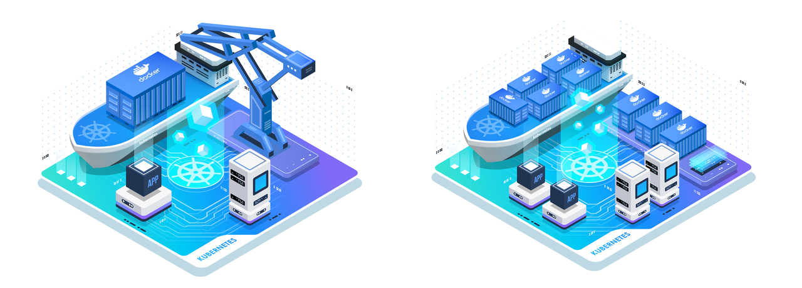

# ft_services

<br/>

------------

❗*You have to have [**Docker**](http://www.docker.com/), [**VirtualBox**](http://www.virtualbox.org/), [**minikube**](http://kubernetes.io/ru/docs/tasks/tools/install-minikube/), [**kubectl**](http://kubernetes.io/ru/docs/tasks/tools/install-kubectl/) &nbsp;installed on your machine to run this project.*


Please see <a href="./subject.pdf">subject.pdf</a> for getting the assignments.

------------

The project goal is to create a <a href="http://kubernetes.io/">kubernetes</a> (k8s) cluster with: nginx, phpmyadmin, wordpress, ftps, mysql, grafana, telegraf and influxdb.

------------
#### Build and Run:

```
./setup.sh
```

#### Services Ports:
```
* FTPS        on port 21
* MySQL       on port 3306
* Wordpress   on port 5050
* Phpmyadmin  on port 5050
* Grafana     on port 3000
* InfluxDB    on port 8086
* Nginx       on port 80, 443 (SSL)
```


#### Log in services info:
```
PhpMyAdmin, Grafana:
* login: curreg
* pass:  root

WordPress admin:
* login: curreg
* pass:  qwerty

ftps:
* login: curreg
* pass:  rootroot

Nginx via ssh:
> ssh curreg@<NginxIP>   # you can get it with command: kubectl get services
* pass: qwerty1234
```
#### Useful commands:
```
# Launch minikube dashboard
minikube dashboard

# Get cluster external IP
minikube ip

# Reset Minikube VM
minikube delete
```

------------
<br/>